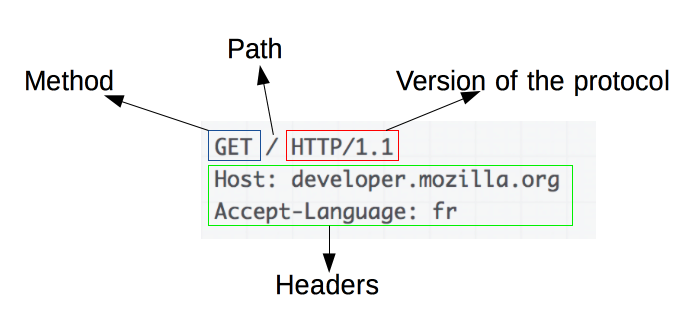

# 웹 애플리케이션 서버

## 진행 방법

* 웹 애플리케이션 서버 요구사항을 파악한다.
* 요구사항에 대한 구현을 완료한 후 자신의 github 아이디에 해당하는 브랜치에 Pull Request(이하 PR)를 통해 코드 리뷰 요청을 한다.
* 코드 리뷰 피드백에 대한 개선 작업을 하고 다시 PUSH한다.
* 모든 피드백을 완료하면 다음 단계를 도전하고 앞의 과정을 반복한다.

## 온라인 코드 리뷰 과정

* [텍스트와 이미지로 살펴보는 온라인 코드 리뷰 과정](https://github.com/next-step/nextstep-docs/tree/master/codereview)

## 기능 요구사항

## 1단계 - HTTP 웹 서버 구현

### 1. GET /index.html 응답하기

* HTTP Request Header 예

```
  GET /index.html HTTP/1.1
  Host: localhost:8080
  Connection: keep-alive
  Accept: */*
```

* 모든 Request Header 출력하기 힌트
  InputStream => InputStreamReader => BufferedReader
  구글에서 “java inputstream bufferedreader “로 검색 후 문제 해결
  BufferedReader.readLine() 메소드 활용해 라인별로 http header 읽는다.
  http header 전체를 출력한다.
  header 마지막은 while (!"".equals(line)) {} 로 확인 가능하다.
  line이 null 값인 경우에 대한 예외 처리도 해야 한다. 그렇지 않을 경우 무한 루프에 빠진다.(if (line == null) { return;})


* Request Line에서 path 분리하기 힌트
  Header의 첫 번째 라인에서 요청 URL(위 예의 경우 /index.html 이다.)을 추출한다.
  String[] tokens = line.split(" "); 활용해 문자열을 분리할 수 있다.
  구현은 별도의 유틸 클래스를 만들고 단위 테스트를 만들어 진행할 수 있다.


* path에 해당하는 파일 읽어 응답하기 힌트
  요청 URL에 해당하는 파일을 src/main/resources 디렉토리에서 읽어 전달하면 된다.
  utils.FileIoUtils의 loadFileFromClasspath() 메소드를 이용해 classpath에 있는 파일을 읽는다.

### 2. CSS 지원하기

   * 인덱스 페이지에 접속하면, 현재 stylesheet 파일을 지원하지 못하고 있다. Stylesheet 파일을 지원하도록 구현하도록 한다.

### 3. Query String 파싱

* “회원가입” 메뉴를 클릭하면 `http://localhost:8080/user/form.html` 으로 이동하면서 회원가입할 수 있다.
* 회원가입을 하면 다음과 같은 형태로 사용자가 입력한 값이 서버에 전달된다.
* HTML과 URL을 비교해 보고 사용자가 입력한 값을 파싱해 model.User 클래스에 저장한다.
* 회원가입할 때 생성한 User 객체를 DataBase.addUser() 메서드를 활용해 RAM 메모리에 저장한다.

### 4. POST 방식으로 회원가입
* `http://localhost:8080/user/form.html` 파일의 form 태그 method를 get에서 post로 수정한 후 회원가입 기능이 정상적으로 동작하도록 구현한다.

### 5. Redirect

* 현재는 “회원가입”을 완료 후, URL이 /user/create 로 유지되는 상태로 읽어서 전달할 파일이 없다. redirect 방식처럼 회원가입을 완료한 후 index.html로 이동해야 한다.

## 2단계 - 로그인 구현하기

### 1. 로그인 기능 구현

* “로그인” 메뉴를 클릭하면 `http://localhost:8080/user/login.html` 으로 이동해 로그인할 수 있다.
* 로그인이 성공하면 index.html로 이동하고, 로그인이 실패하면 /user/login_failed.html로 이동해야 한다.
* 회원가입한 사용자로 로그인할 수 있어야 한다.
* 자바 진영에서 세션 아이디를 전달하는 이름으로 JSESSIONID를 사용한다.
* 서버에서 HTTP 응답을 전달할 때 응답 헤더에 Set-Cookie를 추가하고 JSESSIONID=656cef62-e3c4-40bc-a8df-94732920ed46 형태로 값을 전달하면 클라이언트 요청 헤더의 Cookie 필드에 값이 추가된다.

### 2. 템플릿 엔진 활용하기
* 접근하고 있는 사용자가 “로그인” 상태일 경우(Cookie 값이 logined=true) 경우 `http://localhost:8080/user/list` 로 접근했을 때 사용자 목록을 출력한다. 만약 로그인하지 않은 상태라면 로그인 페이지(login.html)로 이동한다.
* 동적으로 html을 생성하기 위해 handlebars.java template engine을 활용한다.

### 3. Session 구현하기
쿠키에서 전달 받은 JSESSIONID의 값으로 로그인 여부를 체크할 수 있어야 한다.
로그인에 성공하면 Session 객체의 값으로 User 객체를 저장해보자.
로그인된 상태에서 `/user/login` 페이지에 HTTP GET method로 접근하면 이미 로그인한 상태니 index.html 페이지로 리다이렉트 처리한다.


## 구현할 기능 목록



* [x] 모든 Request Header를 출력할 수 있다.
  * [x] 메서드(`CustomMethod`)를 추출할 수 있다.
    * 메서드는 GET과 POST가 존재한다.
  * [x] path(`CustomPath`)를 추출할 수 있다.
  * [x] headers(`CustomHeaders`)를 추출할 수 있다.

* [x] Request Line에서 path 분리할 수 있다.

* [x] path에 해당하는 파일 읽어 응답할 수 있다.

* [x] CSS 및 JS를 지원할 수 있다.

* [x] QueryString을 파싱할 수 있다.
 
* [x] POST 요청을 처리할 수 있다.
  * [x] Request Body값을 추출할 수 있다.

* [x] 회원가입 후 Redirect 응답을 보낼 수 있다.

* [ ] 로그인 기능을 구현할 수 있다.
  * [x] request에서 쿠기 정보를 추출할 수 있다.
    * [x] 쿠키에 JSESSIONID가 존재하는지 확인할 수 있다.
  * [ ] 로그인 성공 시 index.html로 Redirect 응답을 보낼 수 있다.
  * [ ] 로그인 실패 시 login_failed.html로 Redirect 응답을 보낼 수 있다.

* [ ] 템플릿 엔진을 활용할 수 있다.
  * [ ] Handlebars를 활용할 수 있다. 

* [ ] Session을 구현할 수 있다.
  * [ ] 로그인 상태를 체크할 수 있다.
  * [ ] 로그인 상태에서 로그인 페이지로 접근 시 index.html로 Redirect 응답을 보낼 수 있다.
